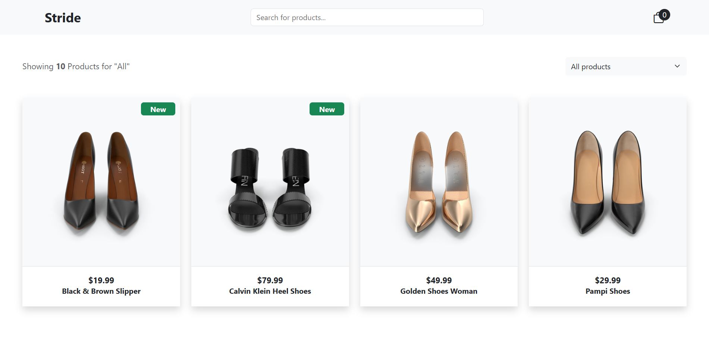
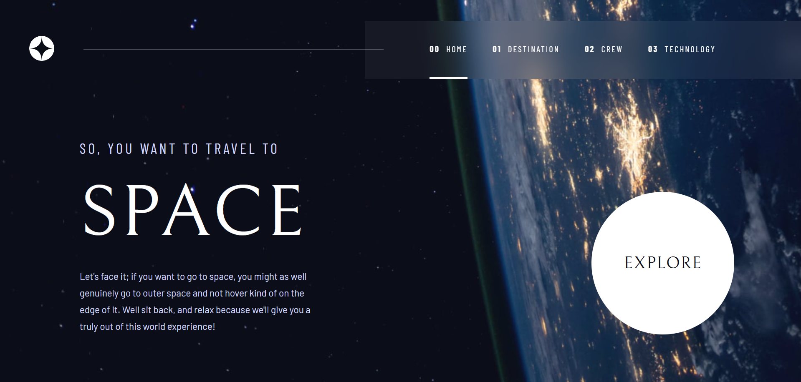
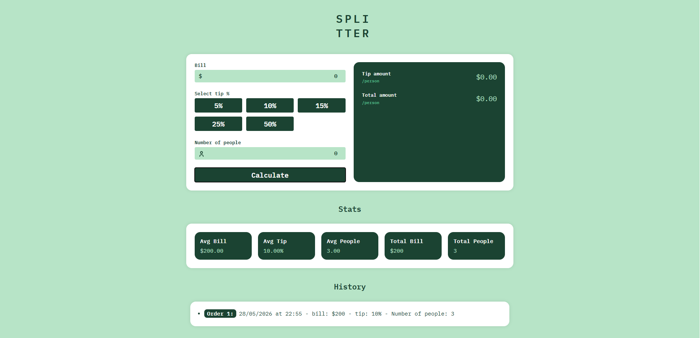
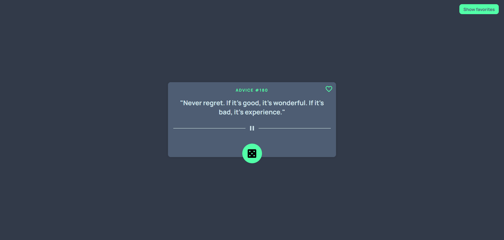
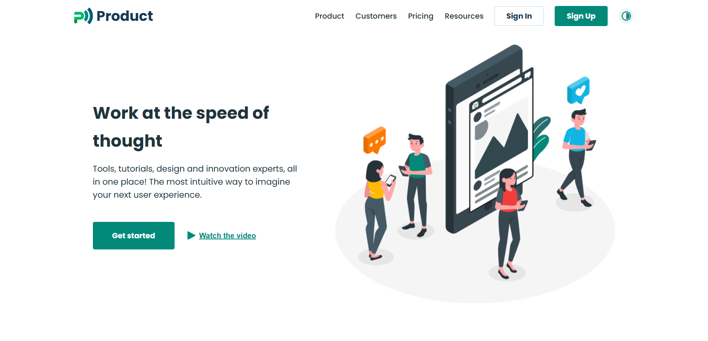

  

  

## About me

Junior Frontend Developer focused on building mobile-first, responsive and user-friendly web applications. I work with React, JavaScript, HTML5, and CSS3 to build well-structured interfaces using reusable components and clean code practices. Currently building personal projects to strengthen my skills in frontend development, performance optimization and code quality.

- 💼 Open to **full-time**, **remote** or **hybrid opportunities**
- 💻 Portfolio: [marinadiana-lungu.netlify.app](https://marinadiana-lungu.netlify.app)

 

## Tech Stack

 

## Featured Projects

<table>
  <tr>
    <td width="43%">
      
    </td>
    <td>
      <h3>
        <a href="https://shoe-store-ecommerce.netlify.app">Shoe Store</a>
      </h3>

- eCommerce shoe store with dynamic data using API
- Search, sorting, and cart management functionality
- Responsive design optimized for all screen sizes
- Product status indicators for New Arrivals and Sale items

  
  
  
  
  

 

  🔗 <a href="https://shoe-store-ecommerce.netlify.app">Live Demo</a> |
  📂 <a href="https://github.com/MarinaDiana01/shoe-store">GitHub</a>

 

</td>
</tr>

<tr><td colspan="2"> </td></tr>

<tr>
  <td width="43%">
    
  </td>
  <td>
    <h3>
      <a href="https://project-space-tourism.netlify.app">Space Tourism</a>
    </h3>

- The project involved building a complex website dedicated to exploring outer space
- Identified and fixed navigation issues between site pages by reconfiguring routes
- Responsive across all devices
- Upcoming features include star maps and an events calendar

  
  
  
  
  

 

  🔗 <a href="https://project-space-tourism.netlify.app">Live Demo</a> |
  📂 <a href="https://github.com/MarinaDiana01/space-tourism">GitHub</a>

 

</td>
</tr>

<tr><td colspan="2"> </td></tr>

<tr>
  <td width="43%">
    
  </td>
  <td>
    <h3>
      <a href="https://project-billing-app.netlify.app">Billing App</a>
    </h3>

- Interactive tip calculator
- Calculates the total bill including tip based on the selected percentage and number of people
- Extended functionality with two additional sections: statistics and history
- Fully responsive interface

  
  
  
  
  

 

  🔗 <a href="https://project-billing-app.netlify.app">Live Demo</a> |
  📂 <a href="https://github.com/MarinaDiana01/billing-app">GitHub</a>

 

</td>
</tr>

<tr><td colspan="2"> </td></tr>
  
<tr>
  <td width="43%">
    
  </td>
  <td>
    <h3>
      <a href="https://project-advice-slip.netlify.app">Advice Slip</a>
    </h3> 

- Generates random advice using the Advice Slip API
- Allows users to save and manage favorite advice using local storage
- Clean, intuitive interface with accessible navigation and clearly defined buttons
- Fully responsive across all devices

  
  
  
  
  

 

  🔗 <a href="https://project-advice-slip.netlify.app">Live Demo</a> |
  📂 <a href="https://github.com/MarinaDiana01/advice-slip">GitHub</a>

 

</td>
</tr>

<tr><td colspan="2"> </td></tr>
 
<tr>
  <td width="43%">
    
  </td>
  <td>
    <h3>
      <a href="https://project-landing-pagee.netlify.app">Landing Page</a>
    </h3>

- Developed according to Figma designs, the landing page unites resources and design experts
- User-focused, intuitive design
- Optimized the landing page for various screen sizes
- JavaScript will be integrated in future updates to improve interactivity and user experience

  
  
  

 

  🔗 <a href="https://project-landing-pagee.netlify.app">Live Demo</a> |
  📂 <a href="https://github.com/MarinaDiana01/landing-page">GitHub</a>

 

</td>
</tr>
</table>

 

## Contact

- **Email:** [marinadiana1999@yahoo.com](mailto:marinadiana1999@yahoo.com)
- **LinkedIn:** [linkedin.com/in/marina-diana-lungu-frontend](https://www.linkedin.com/in/marina-diana-lungu-frontend/)
- **GitHub:** [github.com/MarinaDiana01](https://github.com/MarinaDiana01)
